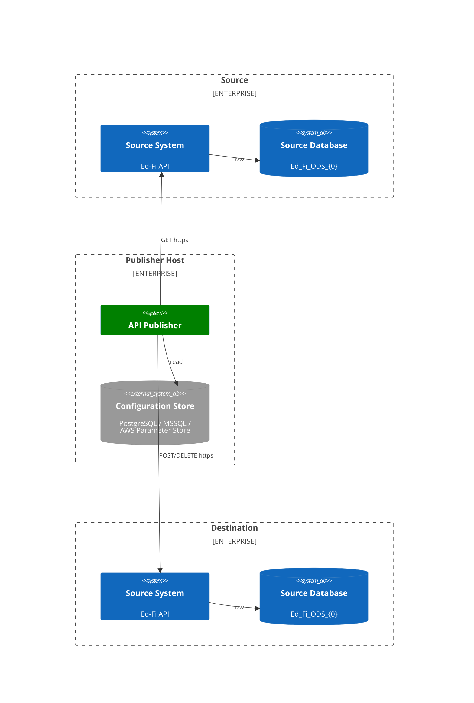

# Ed-Fi API Publisher Product Requirements Document

> **Status:** complete \
> **Owner:** Stephen Fuqua, Ed-Fi Alliance \
> **Jira Project:** APIPUB \
> **Repository:** `Ed-Fi-Alliance-OSS/Ed-Fi-API-Publisher`

## 1. Product Overview

The Ed-Fi API Publisher is a command-line utility that moves data and data changes between two Ed-Fi API instances of the **same** Ed-Fi Data Standard version. It operates as a standard OAuth API client against both source and target APIs and requires no special network configuration, direct database access, or specific database engine.

The publisher is subject to all authorization rules enforced by the Ed-Fi API on both ends, making it compatible with existing security policies without requiring elevated privileges.

## 1.2. Strategic Alignment

### Business Goals

- Enable state education agencies, collaborative organizations, and local education agencies to synchronize Ed-Fi data between separate Ed-Fi API deployments without building custom ETL pipelines.
- Reduce the cost and complexity of data sharing across the Ed-Fi ecosystem by providing a supported, open-source replication utility.
- Support the Ed-Fi Alliance's mission of interoperability in K–12 education data.

### Deployment Drivers

Two primary operational patterns drive the product:

| Pattern  | Description                                                                 |
| -------- | --------------------------------------------------------------------------- |
| **Pull** | Deployed alongside a central (target) API; pulls from multiple source APIs. |
| **Push** | Deployed alongside source APIs; pushes data to a central target.            |

A third operational pattern is to publish to multiple targets from a single source. This requires separate application runs with the same source and different targets; there is no capability to read once and publish to multiple sources in a single run.

## 1.3. User Personas

### 1.3.1 Infrastructure / DevOps Engineer

- Responsible for deploying and scheduling the publisher in cloud or on-premises environments.
- Needs Docker support, environment variable configuration, and robust retry/error behavior.
- Pain points: secret management, scheduling incremental runs, monitoring failures.

### 1.3.2 Ed-Fi Technical Administrator

- Configures named API connections, claim sets, and authorization metadata in the ODS.
- Needs clear guidance on what permissions to grant the publisher client at both source and target.
- Pain points: claim set creation, understanding what data will be replicated.

### 1.3.3 Data Integration Developer

- Needs to tune parallelism, handle failed POST requests with remediation scripts, and filter resources.
- May extend the publisher with custom configuration store or error publisher implementations.
- Pain points: unresolvable reference errors, partial data transfer, descriptor synchronization.

### 1.4. Jobs to Be Done

#### JTBD 1: Full Data Replication on First Sync

**Personas**: Infrastructure/DevOps Engineer, Data Integration Developer

When first-time publishing to a target API, I want to perform a full data copy from source to target, so that the target ODS is fully populated before incremental sync begins.

**How API Publisher Helps**: The publisher detects the absence of a prior `lastChangeVersionsProcessed` value and automatically performs a full export/import cycle, streaming all resources from source to target while respecting dependency order and inclusion/exclusion filters.

#### JTBD 2: Incremental Publishing on a Schedule

**Personas**: Infrastructure/DevOps Engineer, Ed-Fi Technical Administrator

When running the publisher on a schedule, I want to only publish records changed since the last successful run, so that bandwidth and processing time are minimized.

**How API Publisher Helps**: The publisher maintains `lastChangeVersionsProcessed` in the Configuration Store and uses Change Queries to fetch only modified data on subsequent runs. Support for change version paging and reverse paging reduces the risk of records being skipped in high-activity environments.

#### JTBD 3: Secure Multi-Connection Publishing

**Personas**: Infrastructure/DevOps Engineer, Ed-Fi Technical Administrator

When publishing across multiple source/target combinations, I want to use named, pre-configured connections stored securely, so that credentials are not exposed in scripts or command history.

**How API Publisher Helps**: The publisher supports a Configuration Store (SQL Server, PostgreSQL, AWS Parameter Store, or plain text) where named API connections can be encrypted at rest and referenced by name at runtime, keeping secrets out of CLI arguments and environment variables.

#### JTBD 4: Remediating Failed Requests

**Personas**: Data Integration Developer

When the target API rejects a POST due to missing references, I want to apply a custom JavaScript remediation to fix or skip the failing request, so that publishing continues without manual intervention.

**How API Publisher Helps**: The publisher executes user-provided JavaScript remediation scripts on failed POST requests, allowing developers to inspect the failure context and either modify the request, create prerequisite resources, or skip the record. Additional requests from a remediation plan are executed before retrying the original request.

#### JTBD 5: Consistent Replication During Active Publishing

**Personas**: Data Integration Developer, Ed-Fi Technical Administrator

When the source API has ongoing write activity during publishing, I want to read from a static snapshot of the source ODS, so that data is consistent and no records are skipped due to concurrent changes.

**How API Publisher Helps**: The publisher supports Snapshot Isolation on compatible ODS/API deployments, ensuring that all source data reads occur from a consistent point-in-time snapshot, eliminating data inconsistencies and record skipping in active systems.

#### JTBD 6: Publishing with Limited Claim Sets

**Personas**: Data Integration Developer, Ed-Fi Technical Administrator

When publishing to a target API with restricted permissions, I want to treat 403 responses as warnings on specific resources, so that publishing is not halted by data the publisher is not authorized to write.

**How API Publisher Helps**: The publisher supports `--treatForbiddenPostAsWarning` to downgrade authorization failures to warnings per connection, allowing partial publishing in scenarios where the API client has limited claim sets or scope-based access control.

#### JTBD 7: Container-Based Deployment

**Personas**: Infrastructure/DevOps Engineer

When deploying in a container environment, I want to configure all settings via environment variables and a `.env` file, so that the publisher integrates cleanly with Docker Compose and container orchestration.

**How API Publisher Helps**: The publisher accepts all configuration through environment variables (using the `EdFi__Publisher__` prefix on Linux) and supports `.env` file loading, with configuration precedence: CLI arguments > environment variables > `publisherSettings.json`. The official Docker image is available on Docker Hub and ready for orchestration platforms.

#### JTBD 8: Read Once, Publish to Multiple Targets

**Personas**: Data Integration Developer, Ed-Fi Technical Administrator

When I have a single source API and multiple target APIs, I want to run the publisher once per target without re-reading from the source each time, so that I can efficiently replicate data to multiple destinations.

**How API Publisher Helps**: The publisher supports writing JSON records to an intermediate Sqlite database instead of a target API, allowing a single read from the source API and multiple subsequent runs to publish to different targets from the same intermediate data store.

## 2. Enterprise Architecture

The publisher has no persistent HTTP service; it is invoked as a one-shot CLI process. State between runs is maintained in the Configuration Store via the `lastChangeVersionsProcessed` value per source/target pair.

## 3. Functional Requirements

### FR-PUBLISH: Core Publishing

- **FR-PUB-1:** The publisher SHALL perform a full data copy on the first run from a given source to a given target (no prior change version on record).
- **FR-PUB-2:** The publisher SHALL perform incremental publishing (changes only) on subsequent runs when a `lastChangeVersionsProcessed` value exists for the source/target pair and when the source API supports Change Queries.
- **FR-PUB-3:** The publisher SHALL stream data from the source API using paged GET requests and POST each item to the target API.
- **FR-PUB-4:** The publisher SHALL resolve and automatically include all resource dependencies when `--include` is specified, using dependency metadata from the target API.
- **FR-PUB-5:** The publisher SHALL resolve and automatically exclude all dependent resources when `--exclude` is specified.
- **FR-PUB-6:** The publisher SHALL support selective publishing using `--include`, `--includeOnly`, `--exclude`, and `--excludeOnly` filters.
- **FR-PUB-7:** The publisher SHALL optionally include descriptor resources when `--includeDescriptors=true` is set.
- **FR-PUB-8:** The publisher SHALL update `lastChangeVersionsProcessed` in the Configuration Store after a successful incremental publishing run.
- **FR-PUB-9:** The publisher SHALL support year-specific ODS deployments via `--sourceSchoolYear` and `--targetSchoolYear` parameters.
- **FR-PUB-10:** The publisher SHALL support EducationOrganization scoped access tokens via `--sourceScope` and `--targetScope`.
- **FR-PUB-11:** The publisher SHALL support API Profiles via `--sourceProfileName` and `--targetProfileName`. If `--sourceProfileName` is specified, `--targetProfileName` MUST also be specified to prevent accidental data loss on POST. The two profile names may differ; the source profile is applied as a readable content type on GET requests and the target profile as a writable content type on POST/PUT requests.

### FR-CHANGES: Change Query and Version Paging

- **FR-CHG-1:** The publisher SHALL support change version paging (`--useChangeVersionPaging=true`) to process large change sets in windows of configurable size (`--changeVersionPagingWindowSize`, default 25,000).
- **FR-CHG-2:** The publisher SHALL support reverse paging mode (`--useReversePaging=true`) to reduce the risk of records being skipped on active source databases.
- **FR-CHG-3:** The publisher SHALL allow explicit override of the last change version via `--lastChangeVersionProcessed` to enable custom windowed processing.
- **FR-CHG-4:** The publisher SHALL support a namespace prefix for `lastChangeVersionsProcessed` tracking via `--lastChangeVersionProcessedNamespace`, enabling multiple logical publisher instances sharing a named connection.

### FR-CONN: Connection Management

- **FR-CONN-1:** The publisher SHALL support named connections stored in a Configuration Store for both source and target.
- **FR-CONN-2:** The publisher SHALL support inline connection details (URL, key, secret) supplied via CLI arguments or environment variables.
- **FR-CONN-3:** The publisher SHALL support four Configuration Store providers: SQL Server, PostgreSQL, AWS Parameter Store, and PlainText (development only).
- **FR-CONN-4:** SQL Server and PostgreSQL Configuration Store implementations SHALL encrypt API keys and secrets at rest.
- **FR-CONN-5:** AWS Parameter Store implementation SHALL use `SecureString` type for API keys and secrets.
- **FR-CONN-6:** The publisher SHALL accept the Configuration Store provider selection via the `--configurationStoreProvider` CLI argument, the `EdFi:ApiPublisher:ConfigurationStore:Provider` environment variable, or the `provider` value in `configurationStoreSettings.json`.

### FR-RETRY: Resilience and Retry

- **FR-RETRY-1:** The publisher SHALL retry failed requests against source and target APIs using exponential backoff, configurable via `--retryStartingDelayMilliseconds` and `--maxRetryAttempts`.
- **FR-RETRY-2:** The publisher SHALL optionally enforce rate limiting on API requests via `--enableRateLimit`, `--rateLimitNumberExecutions`, `--rateLimitTimeSeconds`, and `--rateLimitMaxRetries`.
- **FR-RETRY-3:** The publisher SHALL periodically refresh bearer tokens before expiry, configurable via `--bearerTokenRefreshMinutes` (default 28 minutes).

### FR-AUTH: Authorization Failure Handling

- **FR-AUTH-1:** The publisher SHALL support configurable authorization failure handling, allowing specific resources to be retried after prerequisite resources have been processed (e.g., retry `students` after `studentSchoolAssociations`).
- **FR-AUTH-2:** The publisher SHALL support treating `403 Forbidden` responses on POST requests as warnings rather than failures, per-connection, via `--treatForbiddenPostAsWarning`.

### FR-REMED: Remediations

- **FR-REMED-1:** The publisher SHALL support user-provided JavaScript remediation scripts, executed via Node.js, to handle failed POST requests against the target API.
- **FR-REMED-2:** Remediation scripts SHALL receive a `FailureContext` object (resource URL, request body, response status code, response body, source/target connection names) and SHALL return a `RemediationPlan` object (optional modified request body, optional array of additional POST requests).
- **FR-REMED-3:** The publisher SHALL execute additional requests from a `RemediationPlan` in sequence before retrying the original failed request.

### FR-LOG: Logging and Observability

- **FR-LOG-1:** The publisher SHALL use Serilog for structured logging with configurable sinks: Console, File, and AWS CloudWatch.
- **FR-LOG-2:** The publisher SHALL log progress updates while streaming, at a configurable interval (`--streamingPagesWaitDurationSeconds`, default 10 seconds).
- **FR-LOG-3:** The publisher SHALL support a configurable Serilog `TextFormatter` for log output format customization.
- **FR-LOG-4:** The publisher SHALL batch error records for writing to the error publisher, configurable via `--errorPublishingBatchSize` (default 25).

## 4. Non-Functional Requirements

### NFR-SEC: Security

- **NFR-SEC-1:** The publisher SHALL not require direct database access to the source or target ODS; all data access SHALL be through the ODS/API.
- **NFR-SEC-2:** API keys and secrets stored in SQL Server or PostgreSQL Configuration Stores SHALL be encrypted using AES-256 symmetric key encryption.
- **NFR-SEC-3:** The remediation scripts feature SHALL document and warn that JavaScript code runs outside a sandbox, requiring operators to allow only trusted scripts.
- **NFR-SEC-4:** The publisher SHALL be subject to all authorization policies enforced by the source and target Ed-Fi ODS/API endpoints.

### NFR-COMPAT: Compatibility

- **NFR-COMPAT-1:** The publisher SHALL require source and target ODS/API instances to be the same Ed-Fi version.
- **NFR-COMPAT-2:** The publisher SHALL target .NET 8.0.
- **NFR-COMPAT-3:** The publisher SHALL support deployment on Windows (x64 native binary) and Linux (via Docker).
- **NFR-COMPAT-4:** The publisher SHOULD support reading from or writing to a Sqlite database as an alternative to an Ed-Fi API, for testing or non-API data movement scenarios.

### NFR-PERF: Performance

- **NFR-PERF-1:** The publisher SHALL support configurable parallelism at three levels: resource processing (`--maxDegreeOfParallelismForResourceProcessing`, default 10), POST requests per resource (`--maxDegreeOfParallelismForPostResourceItem`, default 20), and paged GET requests per resource (`--maxDegreeOfParallelismForStreamResourcePages`, default 5).
- **NFR-PERF-2:** The publisher SHALL support a configurable page size for streaming source data (`--streamingPageSize`, default 75).

### NFR-OPS: Operations

- **NFR-OPS-1:** The publisher SHALL be runnable as a Docker container using Docker Compose, with all configuration injectable via environment variables.
- **NFR-OPS-2:** The publisher SHALL support scheduling as a recurring CLI process (e.g., cron, Task Scheduler) for incremental sync workloads.
- **NFR-OPS-3:** Configuration values SHALL follow the precedence order: CLI arguments > environment variables > `publisherSettings.json`.
- **NFR-OPS-4:** Environment variable names for configuration SHALL use the `EdFi:Publisher:` prefix (or `EdFi__Publisher__` with double underscores on Linux).

### NFR-EXT: Extensibility _(inferred from Extensibility.md — noted as stale)_

- **NFR-EXT-1:** The publisher SHOULD expose an `IErrorPublisher` interface to allow alternative error output implementations (e.g., Amazon DynamoDB, Azure Cosmos DB).
- **NFR-EXT-2:** The publisher SHOULD expose an `INamedApiConnectionDetailsReader` interface to allow alternative Configuration Store implementations.
- **NFR-EXT-3:** The publisher SHOULD expose an `IChangeVersionProcessedWriter` interface to allow alternative persistence of the last-processed change version.

## 5. System Architecture

### Components

| Component                                               | Role                                                                                              |
| ------------------------------------------------------- | ------------------------------------------------------------------------------------------------- |
| `EdFi.Tools.ApiPublisher.Cli`                           | CLI entry point; parses arguments, wires up DI, initiates publishing.                             |
| `EdFi.Tools.ApiPublisher.Core`                          | Core publishing engine, pagination, retry, authorization failure handling, remediations, logging. |
| `EdFi.Tools.ApiPublisher.Connections.Api`               | HTTP client logic for communicating with Ed-Fi ODS/API REST endpoints.                            |
| `EdFi.Tools.ApiPublisher.Connections.Sqlite`            | Alternative logic using Sqlite as data source or target                                           |
| `EdFi.Tools.ApiPublisher.ConfigurationStore.Aws`        | AWS Parameter Store configuration provider.                                                       |
| `EdFi.Tools.ApiPublisher.ConfigurationStore.Plaintext`  | Plain-text configuration provider (development only).                                             |
| `EdFi.Tools.ApiPublisher.ConfigurationStore.PostgreSql` | PostgreSQL configuration provider with `pgcrypto` encryption.                                     |
| `EdFi.Tools.ApiPublisher.ConfigurationStore.SqlServer`  | SQL Server configuration provider with AES-256 encryption.                                        |
| `EdFi.Tools.ApiPublisher.Tests`                         | Integration/unit test suite.                                                                      |

### Runtime Targets

- **Windows**: Native `.exe` binary (`EdFiApiPublisher.exe`), also available as NuGet package.
- **Docker**: Official image on Docker Hub (`edfialliance/ods-api-publisher`).

### Data Ownership

The publisher does not own any persistent data storage. The Configuration Store holds:

- Named connection metadata (URL, key, secret, filters, isolation settings).
- `lastChangeVersionsProcessed` per source/target connection pair.

## 9. Out of Scope and Known Limitations

### Current Limitations

| Limitation                                  | Detail                                                                                                             | Resolution Status                |
| ------------------------------------------- | ------------------------------------------------------------------------------------------------------------------ | -------------------------------- |
| Support for ODS/API < 6                     | Due to limitations in the Change Queries implementations, only ODS/API versions 6.0 and above are fully supported. | Final                            |
| Primary key change publishing (ODS 5.1–5.3) | Key changes are not fully tracked; stale copies of resources with old key values remain in the target.             | Resolved in ODS 5.3-cqe and 6.1. |
| Descriptor delete publishing                | Internal ODS implementation details prevent descriptor deletions from being published.                             | No current timeline.             |
| Cross-version publishing                    | Source and target must be the same Ed-Fi version. Cross-version migration is out of scope.                         | By design.                       |

### Explicit Exclusions

- The publisher is not a general-purpose ETL tool; it only operates between two Ed-Fi ODS/API instances.
- It does not transform data; records are published as-is from source to target.
- It does not manage claim sets, API clients, or security metadata in the ODS; those must be configured separately.
- It does not provide a UI or web interface.
- It does not detect conflicts when the same record is modified independently in both source and target.

## 10. Glossary

| Term                              | Definition                                                                                                                                              |
| --------------------------------- | ------------------------------------------------------------------------------------------------------------------------------------------------------- |
| **Change Query / Change Queries** | An Ed-Fi ODS/API feature that exposes a change log enabling API clients to retrieve only records modified since a given change version.                 |
| **Change Version**                | A monotonically increasing integer maintained by the ODS/API that identifies the point-in-time of a given data change.                                  |
| **Claim Set**                     | A named set of resource permissions assigned to an API client in the Ed-Fi ODS security model.                                                          |
| **Configuration Store**           | A persistence layer (SQL Server, PostgreSQL, AWS Parameter Store, or plain text) used to store named API connection details and publishing state.       |
| **Descriptor**                    | A controlled-vocabulary reference value in the Ed-Fi data model (e.g., GradeLevelDescriptor).                                                           |
| **Ed-Fi ODS/API**                 | The Ed-Fi Operational Data Store and API, the primary data platform in the Ed-Fi ecosystem.                                                             |
| **lastChangeVersionsProcessed**   | The change version of the most recently successfully published item from a source, stored per source/target connection pair to enable incremental sync. |
| **Named Connection**              | A pre-configured, named API connection stored in the Configuration Store, referenced by name at runtime instead of providing credentials inline.        |
| **Remediation Script**            | A user-provided JavaScript module that handles specific failed POST requests against the target API by supplying modified or additional requests.       |
| **Snapshot Isolation**            | A mechanism in the Ed-Fi ODS where a static copy of the database is made available to API clients, ensuring consistent reads during publishing.         |
